# Proof of Concept: Price Test Easy Tool

**Development Status**: ✅ Completed MVP + Advanced Features  
**Demo Link**: https://price-test-smalltool.vercel.app/

## 🎯 Objective

✅ **COMPLETED**: Built an advanced interactive Price A/B Testing simulation tool that:
- Visualizes how different pricing strategies affect conversion rate, revenue, and profit
- Supports both manual parameter input and CSV product upload
- Includes advanced cost modeling (COGS, shipping fees, transaction fees)
- Features OEC (Overall Evaluation Criterion) optimization
- Provides optimal pricing recommendations with real-time analysis

The tool successfully helps Shopify merchants gain intuitive insights into pricing impact—driving interest and traffic to ABConvert's A/B testing product.

---

## ✅ Problem Solve

**Original Problem**: Most merchants lack an intuitive grasp of how pricing influences customer behavior.

**Solution Implemented**: 
- Interactive visualization showing immediate impact of pricing changes
- CSV upload functionality allowing merchants to use their actual product data
- Comprehensive cost modeling including all business expenses
- Clear educational content explaining why A/B testing matters
- Direct comparison between simulation and real-world testing needs

---
# wireframe

### User Wireframe

### Tech Wireframe

```mermaid
flowchart TD
    A[Start] --> B[🔹 User Inputs]
    B --> B1{Input Fields}
    B1 --> B1a[mu: Average WTP]
    B1 --> B1b[sigma: Std Dev]
    B1 --> B1c[cost: Unit Cost]
    B1 --> B1d[traffic: Visitors]
    B1 --> B1e[Price A / B]
    B1 --> B1f[Min / Max Price Range]

    B --> C[📊 Generate Price Distribution]
    C --> D[🧮 Calculate Metrics Per Price]
    D --> D1[Conversion Rate]
    D --> D2[Revenue = price × conversion × traffic]
    D --> D3[Profit = price minus cost  × conversion × traffic]

    D --> E[📈 Render ResultChart]
    E --> E1[Draw 3 Lines: Revenue, Profit, ConvRate]
    E --> E2[Mark Price A / B on Graph]

    E --> F[📊 Compare Price A vs B]
    F --> F1[Show metrics side-by-side]
    F --> G[🔗 Link to ABConvert]
    G --> H([https://www.abconvert.io])
```

---

## User Psychology Journey

### Emotional Arc:
1. **Curiosity** → "What's this tool about?"
2. **Engagement** → "Let me try with my numbers"
3. **Surprise** → "The impact is bigger than expected"
4. **Concern** → "Am I making wrong pricing decisions?"
5. **Understanding** → "I need real data, not just simulation"
6. **Intent** → "I should try A/B testing" => ABConvert

### Objection Handling:
- **"Is this relevant to me?"** → Easy customization with their numbers
- **"Is it accurate?"** → Clear disclaimer about simulation limitations
- **"What should I do next?"** → Clear path to real A/B testing solution

### Trust Building:
- **Transparency**: Shows it's a simulation, not real data
- **Education**: Explains why real testing matters
- **No pressure**: Tool provides value before asking for anything
- **Credibility**: Professional interface with realistic calculations

## 🔢 Enhanced Mathematical Model

**Core Variables**:
- μ = Average Willingness to Pay (WTP)
- σ = Standard Deviation of WTP
- COGS = Cost of Goods Sold (replaces simple unit cost)
- SF = Shipping Fee per item
- TF% = Transaction Fee percentage
- N = Traffic/potential customers
- P = Target price

**Advanced Formulas**:
- ConversionRate(P) = Φ((μ - P)/σ)
- Revenue(P) = P × N × ConversionRate(P)
- TotalCost(P) = COGS + SF + (P × TF%)
- **Profit(P) = (P - TotalCost(P)) × N × ConversionRate(P)**

**OEC Optimization**:
- Finds optimal price based on selected criterion (Revenue/Profit/Conversion Rate)
- Displays optimal price with visual indicators on charts

Where Φ is the standard normal CDF implemented with Abramowitz-Stegun approximation.

## 🛠️ Tech Stack

- **Framework**: Next.js 15 (App Router with client-side rendering)
- **Frontend**: React 19 with TypeScript for type safety
- **Styling**: Tailwind CSS 4 (utility-first with responsive grid layouts)
- **Visualization**: Recharts (dual-axis line charts, interactive sliders)
- **Data Processing**: Papa Parse for CSV file parsing
- **Mathematical Core**: Custom statistical functions (error function, normal CDF)
- **State Management**: React useState hooks for simulation parameters
- **Hosting**: Vercel deployment with live demo at https://price-test-smalltool-bbwtgosny-wens-projects-37d51605.vercel.app/

## 🧪 Implemented Features

### ✅ Core Simulation Engine
- Interactive input panel for Willingness to Pay (μ), Standard Deviation (σ), traffic, and pricing parameters
- Real-time chart updates with dual-mode visualization (revenue/profit and conversion rate)
- Optimal price calculation and display with OEC (Overall Evaluation Criterion)

### ✅ Dual Input Modes
- **Manual Mode**: Direct parameter input for theoretical scenarios
- **CSV Upload Mode**: Shopify product data integration using Papa Parse

### ✅ Advanced Cost Modeling
- COGS (Cost of Goods Sold) integration
- Configurable shipping fees per item
- Transaction fee percentage calculations
- Comprehensive profit analysis: `Profit = (Price - (COGS + Shipping + Transaction Fee)) × Traffic × Conversion Rate`

### ✅ Interactive Visualizations
- Recharts-based line charts with price range highlighting
- Interactive price adjustment sliders with real-time feedback
- Price marker alignment with visual indicators
- Reference lines for Original Price, Price B, and Optimal Price

### ✅ Educational Content & CTA
- Detailed explanation of A/B testing value proposition
- Side-by-side price comparison analysis
- Statistical significance explanation and simulation limitations
- Direct call-to-action linking to ABConvert platform

### ✅ User Experience Enhancements
- Responsive design for mobile and desktop
- Smart content hiding based on selection state
- Intelligent price boundary setting (manual: ±30% WTP, CSV: 1-2x product price)
- Professional styling with gradient backgrounds and consistent spacing

## 🚀 Goals - ✅ ACHIEVED

- ✅ **Demonstrate A/B Testing Value**: Tool successfully shows potential profit improvements (example: 25-50% profit lifts)
- ✅ **Engage Merchants**: Interactive simulation creates "aha moments" about pricing impact
- ✅ **Educational Onboarding**: Comprehensive explanation of why real A/B testing beats guesswork
- ✅ **Lightweight & Accessible**: No-login required, direct web access, mobile-friendly
- ✅ **Embeddable Solution**: Clean, professional interface suitable for integration
- ✅ **Drive ABConvert Adoption**: Clear CTA pathway from simulation to real A/B testing platform

## 📝 Current Status & Next Steps

### ✅ Completed Development
- **Frontend**: Fully built with dual-mode interface (manual + CSV upload)
- **Backend Logic**: Complete mathematical simulation engine implemented
- **User Testing**: Tool ready for real-world merchant engagement
- **Deployment**: Live and accessible at demo URL

### 🎯 Recommended Next Steps
1. **Analytics Integration**: Add tracking for user engagement and CTA conversion rates
2. **A/B Test the Tool Itself**: Test different messaging, CTAs, or simulation defaults
3. **Content Marketing**: Integrate into blog posts, email campaigns, and onboarding flows
4. **Merchant Feedback**: Gather qualitative feedback on tool usefulness and clarity
5. **Advanced Features**: Consider adding scenario comparison, confidence intervals, or sample size calculators
6. **Backend Integration**: Optional user accounts for saving simulation scenarios and test plans

### 🚀 Success Metrics to Monitor
- Time spent on tool (engagement depth)
- CTA click-through rate to ABConvert
- Simulation parameter adjustments (learning behavior)
- Return visits and social sharing
