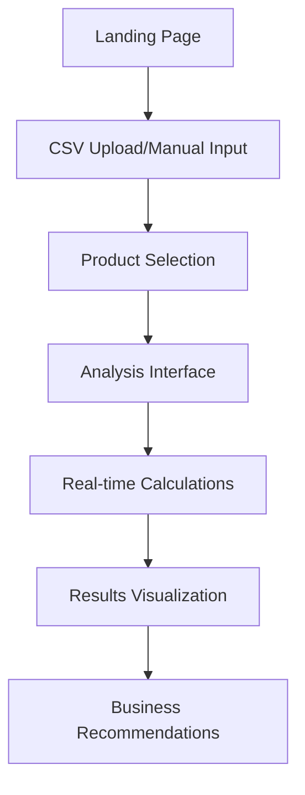

# 🚀 ABConvert A/B Price Testing Tool

**Professional pricing analysis tool for e-commerce optimization**

[](https://price-test-smalltool.vercel.app/)
[](#)
[](#)
[](#)

> 🎯 **Mission**: Democratize pricing optimization through intuitive, data-driven analysis tools that help e-commerce businesses maximize revenue and profit.

## 📖 Table of Contents

- [🎯 What is this?](#-what-is-this)
- [✨ Key Features](#-key-features)
- [🚀 Quick Start](#-quick-start)
- [📁 Project Structure](#-project-structure)
- [🔧 Technical Architecture](#-technical-architecture)
- [📊 How to Use](#-how-to-use)
- [🛠️ Development](#-development)
- [🚀 Deployment](#-deployment)
- [📚 Documentation](#-documentation)
- [🤝 Contributing](#-contributing)
- [📄 License](#-license)

## 🎯 What is this?

The **ABConvert A/B Price Testing Tool** is an advanced, educational pricing analysis platform that enables e-commerce businesses to understand the impact of pricing decisions through mathematical modeling and interactive simulations.

### 🌟 **Live Demo**: [price-test-smalltool.vercel.app](https://price-test-smalltool.vercel.app/)

### 🏢 Built by ABConvert Team
This tool serves as both a standalone pricing analysis solution and a demonstration of ABConvert's capabilities in building sophisticated e-commerce optimization tools.

## ✨ Key Features

### 🎯 **Core Functionality**
- **📊 Interactive Price Analysis**: Real-time price adjustment with dual sliders
- **🔍 Optimal Price Discovery**: Automatic calculation of revenue/profit-maximizing prices  
- **📈 Advanced Visualizations**: Dynamic charts using Recharts
- **⚖️ A/B/Optimal Comparison**: Three-way comparison tables with key metrics

### 💼 **Business Intelligence**
- **💰 Comprehensive Cost Modeling**: COGS + Shipping + Transaction fees
- **📊 Price Elasticity Simulation**: Normal distribution-based WTP modeling
- **🎯 Multi-Objective Optimization**: Revenue, Profit, or Conversion Rate focus
- **📋 Educational Content**: Built-in explanations and business guidance

### 🔄 **Data Integration**  
- **📁 CSV Upload**: Shopify product exports and compatible formats
- **✏️ Manual Input**: Quick theoretical analysis for testing
- **💾 Session Persistence**: Maintains state across page navigation
- **🚀 Demo Data**: Pre-loaded examples for immediate testing

### 🎨 **User Experience**
- **📱 Responsive Design**: Optimized for mobile, tablet, and desktop
- **🌙 ABC Design System**: Professional dark theme with custom color palette
- **🔄 Three-Page Flow**: Landing → Analysis → Results
- **❓ Integrated Help**: Floating help manual with comprehensive guidance

## 🚀 Quick Start

### 🎯 **Try Online First**
👉 **[Launch Live Demo](https://price-test-smalltool.vercel.app/)** - No installation required!

### 💻 **Local Development Setup**

#### Prerequisites
- **Node.js** 18.0+ ([Download here](https://nodejs.org/))
- **npm** (comes with Node.js) or **yarn**
- **Git** for version control

#### Installation Steps

```bash
# 1. Clone the repository
git clone <repository-url>
cd price_test_smalltool

# 2. Install dependencies
npm install
# or if you prefer yarn:
# yarn install

# 3. Start development server
npm run dev
# or: yarn dev

# 4. Open in browser
# Navigate to http://localhost:3000
```

#### ⚡ **Quick Commands**
```bash
npm run dev      # Start development server (port 3000)
npm run build    # Build for production  
npm run start    # Start production server
npm run lint     # Code quality check
```

### 🔧 **Development Environment**
- **Hot Reload**: Changes reflect instantly
- **TypeScript**: Full type checking enabled
- **ESLint**: Code quality enforcement
- **Tailwind CSS**: Utility-first styling

## 📁 Project Structure

```
price_test_smalltool/
├── 📂 src/                          # Source code
│   ├── 📂 app/                      # Next.js App Router (Pages)
│   │   ├── layout.tsx               # Root layout
│   │   ├── page.tsx                 # Landing page (CSV upload)
│   │   ├── globals.css              # Global styles + ABC colors
│   │   ├── 📂 analysis/             # Interactive analysis page  
│   │   │   ├── layout.tsx           # Analysis layout
│   │   │   └── page.tsx             # Price adjustment interface
│   │   └── 📂 results/              # Results comparison page
│   │       ├── layout.tsx           # Results layout  
│   │       └── page.tsx             # Charts and comparison
│   ├── 📂 components/               # React Components
│   │   ├── 🔧 Core Components/
│   │   │   ├── InteractivePriceChart.tsx     # Main analysis interface
│   │   │   ├── ComparisonTable.tsx           # A/B/Optimal table
│   │   │   ├── CsvUploader.tsx               # File upload handler
│   │   │   └── PriceComparisonChart.tsx      # Results visualization
│   │   ├── 🎨 UI Components/
│   │   │   ├── HelpManual.tsx                # User guide
│   │   │   ├── ManualInputForm.tsx           # Manual entry form
│   │   │   ├── ExplanationText.tsx           # Educational content
│   │   │   └── StepIndicator.tsx             # Progress indicator
│   │   └── 🔧 Utility Components/
│   │       ├── ErrorBoundary.tsx             # Error handling
│   │       ├── LoadingSkeleton.tsx           # Loading states
│   │       └── DebugPanel.tsx                # Development tools
│   ├── 📂 services/                 # Business Logic
│   │   └── aiPricingAnalyzer.ts              # AI pricing analysis
│   └── 📂 utils/                    # Helper Functions
│       └── math.ts                           # Mathematical calculations
├── 📂 docs/                         # Documentation
│   ├── 📋 TECHNICAL_DOCUMENTATION.md        # Complete tech docs
│   ├── 📚 Documentation_Index.md            # Docs navigation
│   ├── 📊 Project_Status_Summary.md         # Current status
│   └── 📂 condensed/                        # Organized docs
│       ├── technical/               # Tech specifications
│       ├── business/                # Business requirements
│       ├── design/                  # Design system
│       └── development/             # Dev guides
├── 📂 public/                       # Static Assets
│   ├── company_icon.png             # ABConvert logo
│   ├── favicon.ico                  # Site icon
│   └── robots.txt                   # SEO configuration
├── 📋 CLAUDE.md                     # AI assistant instructions
├── 📋 README.md                     # This file
├── 📋 package.json                  # Dependencies & scripts
└── 📋 tsconfig.json                 # TypeScript configuration
```

## 🔧 Technical Architecture

### 🏗️ **Technology Stack**

| Layer | Technology | Purpose |
|-------|------------|---------|
| **Framework** | Next.js 15 | App Router, SSG/SSR, Performance |
| **Language** | TypeScript 5 | Type safety, Developer experience |
| **Styling** | Tailwind CSS 4 | Responsive design, ABC color system |  
| **Charts** | Recharts 3.x | Interactive data visualization |
| **Data** | Papa Parse | CSV processing and parsing |
| **State** | React 19 + SessionStorage | Client-side state management |
| **Deployment** | Vercel | Zero-config deployment |

### 🧮 **Mathematical Foundation**

The tool implements a **sophisticated price elasticity model** based on customer Willingness to Pay (WTP) using normal distribution:

```typescript
// Core price elasticity calculation
const elasticityMultiplier = 
  normCDF(μ - newPrice, 0, σ) / normCDF(μ - originalPrice, 0, σ);

const predictedConversionRate = 
  baseConversionRate * elasticityMultiplier;

// Revenue and profit calculations
const revenue = newPrice * predictedConversionRate * traffic;
const profit = (newPrice - totalCosts) * predictedConversionRate * traffic;
```

### 📊 **Key Model Parameters**

| Parameter | Symbol | Default | Range | Description |
|-----------|---------|---------|-------|-------------|
| **Mean WTP** | μ (mu) | 100 | 50-500 | Average customer willingness to pay |
| **Price Sensitivity** | σ (sigma) | 30 | 10-100 | Standard deviation of price sensitivity |
| **Base Conversion** | - | 50% | 1%-100% | Current conversion rate baseline |
| **Traffic Volume** | - | 1000 | 100-10000 | Expected daily visitors |

### 🏛️ **System Architecture**



## 📊 How to Use

### 🎬 **Three-Step Process**

#### **Step 1: Data Input** (Landing Page)
Choose your preferred analysis method:

- **📁 CSV Upload (Recommended)**
  - Upload Shopify product exports or compatible CSV files
  - Automatic parsing of product data and costs
  - Supports batch product analysis
  
- **📝 Manual Input (Testing)**
  - Quick theoretical analysis for specific scenarios
  - Perfect for testing pricing concepts
  - No file upload required

- **🚀 Demo Mode (Instant)**
  - Pre-loaded sample products
  - Immediate access to full functionality
  - Great for exploring tool capabilities

#### **Step 2: Interactive Analysis** (Analysis Page)
- **🎚️ Dual Price Sliders**: Adjust Price A and Price B with real-time feedback
- **📊 Live Metrics**: Watch conversion rates, revenue, and profit update instantly  
- **🎯 Optimal Price Discovery**: System calculates and displays ideal pricing
- **⚙️ Advanced Parameters**: Fine-tune mathematical model settings
- **📋 Business Context**: Configure costs, traffic, and conversion baselines

#### **Step 3: Results Comparison** (Results Page)
- **📈 Visual Charts**: Interactive Recharts visualizations
- **⚖️ A/B/Optimal Table**: Side-by-side comparison of all scenarios
- **💡 Business Insights**: Data-driven recommendations and next steps
- **📊 Key Metrics**: Revenue impact, profit margins, conversion changes

### 📋 **CSV Format Support**

| Required Columns | Optional Columns | Description |
|------------------|------------------|-------------|
| `Title` | `Handle` | Product name/identifier |
| `Variant Price` | `Cost per item` | Current selling price |
| - | `Shipping Cost` | COGS (Cost of Goods Sold) |
| - | `Transaction Fee` | Additional per-item costs |

**Supported Formats**: Shopify exports, WooCommerce exports, or any CSV with price data

## 🎓 **Educational Impact & Business Value**

### 🎯 **Learning Objectives**
- **📊 Price Elasticity Understanding**: Visual demonstration of how price changes affect demand
- **💰 Business Impact Awareness**: Clear ROI calculations and profit optimization insights  
- **🧪 A/B Testing Importance**: Emphasizes the critical need for real-world validation
- **📈 Data-Driven Decisions**: Encourages systematic approach to pricing strategies

### 💼 **Business Applications**
- **🔍 Pricing Strategy Planning**: Initial analysis before implementing changes
- **📋 Scenario Modeling**: Test multiple pricing approaches safely
- **👥 Team Education**: Align stakeholders on pricing impact and methodology
- **🚀 Professional Tool Interest**: Gateway to comprehensive A/B testing platforms

## 🛠️ **Development & Maintenance**

### 🔧 **Development Commands**
```bash
# 🚀 Development
npm run dev          # Start development server (localhost:3000)
npm run build        # Build optimized production version
npm run start        # Start production server

# 🔍 Code Quality  
npm run lint         # Run ESLint code quality checks
npm run typecheck    # TypeScript type validation (if configured)

# 🧪 Testing & Debugging
npm run dev -- --debug    # Enable debug mode
# Access debug mode: localhost:3000?debug=true
```

### 📋 **Quality Assurance Checklist**
Before deployment or sharing:
- [ ] ✅ All TypeScript errors resolved
- [ ] ✅ ESLint checks pass
- [ ] ✅ Responsive design tested (375px, 768px, 1440px)  
- [ ] ✅ All major user flows functional
- [ ] ✅ CSV upload and parsing working
- [ ] ✅ Mathematical calculations accurate
- [ ] ✅ Charts and visualizations rendering properly

## 🚀 **Deployment**

### 🌐 **Vercel (Recommended)**
```bash
# Automatic deployment
1. Connect GitHub repository to Vercel
2. Vercel auto-detects Next.js configuration  
3. Deploy with zero additional configuration
4. Automatic HTTPS and global CDN included
```

### 🔧 **Other Platforms**
```bash  
# Manual deployment
npm run build        # Creates optimized production build
# Deploy the 'out/' directory to your hosting platform
```

### 📊 **Performance Targets**
- **Lighthouse Score**: 90+ across all metrics
- **First Contentful Paint**: < 1.5s
- **Time to Interactive**: < 3s
- **Bundle Size**: < 250KB per page

## 🤝 **Contributing & Collaboration**

### 👥 **For Partners & Collaborators**
We welcome contributions from partners and team members:

1. **🔀 Fork & Branch**: Create feature branches from `main`
2. **🧪 Test Thoroughly**: Ensure all functionality works across devices
3. **📝 Document Changes**: Update relevant documentation
4. **🔍 Code Review**: Submit PR for team review before merging

### 📋 **Development Guidelines**
- **TypeScript First**: Maintain full type safety
- **ABC Design System**: Follow established color and component patterns
- **Responsive Design**: Mobile-first approach with proper breakpoints
- **Performance**: Optimize for speed and minimal bundle size
- **Accessibility**: Maintain WCAG AA compliance standards

### 🎨 **Code Standards**
```typescript
// ✅ Good: Typed, documented, clear naming
interface PricingAnalysisProps {
  /** Current product being analyzed */
  productData: ProductData;
  /** Callback when analysis completes */
  onAnalysisComplete: (results: AnalysisResults) => void;
}

// ❌ Avoid: Untyped, unclear naming
function doStuff(data: any, callback: Function) { ... }
```

## 📚 **Documentation & Resources**

### 📖 **Complete Documentation**
| Document | Purpose | Audience |
|----------|---------|----------|
| **[📋 TECHNICAL_DOCUMENTATION.md](./TECHNICAL_DOCUMENTATION.md)** | Complete technical reference | Developers, DevOps |
| **[📚 Documentation_Index.md](./docs/Documentation_Index.md)** | Navigation hub | All stakeholders |
| **[📊 Project_Status_Summary.md](./docs/Project_Status_Summary.md)** | Current project status | Project managers |
| **[🎨 design-principles.md](./docs/design-principles.md)** | ABC design system | Designers, Frontend devs |

### 🔗 **Key Resources**
- **🌐 Live Demo**: [price-test-smalltool.vercel.app](https://price-test-smalltool.vercel.app/)
- **💼 ABConvert Platform**: [abconvert.io](https://abconvert.io) 
- **📖 Next.js Documentation**: [nextjs.org](https://nextjs.org/docs)
- **🎨 Tailwind CSS**: [tailwindcss.com](https://tailwindcss.com/docs)

## 📄 **License & Legal**

This project is proprietary software developed by **ABConvert Team**.

- **Internal Use**: Authorized for ABConvert team members and approved partners
- **Sharing**: Partner sharing permitted with proper attribution
- **Modifications**: Contributions welcome through proper channels
- **Commercial Use**: Contact ABConvert team for licensing arrangements

---

## 🏢 **About ABConvert**

**ABConvert** is a leading provider of A/B testing and conversion optimization solutions for e-commerce businesses. This pricing tool demonstrates our commitment to democratizing data-driven decision making through intuitive, powerful analysis tools.

### 🌟 **Our Mission**
Empower e-commerce businesses with the tools and insights needed to maximize revenue through systematic testing and optimization.

---

**Built with ❤️ by the ABConvert Team**

*Ready to take your pricing strategy to the next level? Explore our professional A/B testing platform at [abconvert.io](https://abconvert.io)*