# 📄 Proof of Concept: Price Test Easy Tool

**Development Status**: ✅ Completed MVP + Advanced Features  
**Demo Link**: https://price-test-smalltool.vercel.app/

## 🎯 Objective

✅ **COMPLETED**: Built an advanced interactive Price A/B Testing simulation tool that:
- Visualizes how different pricing strategies affect conversion rate, revenue, and profit
- Supports both manual parameter input and CSV product upload
- Includes advanced cost modeling (COGS, shipping fees, transaction fees)
- Features OEC (Overall Evaluation Criterion) optimization
- Provides optimal pricing recommendations with real-time analysis

The tool successfully helps Shopify merchants gain intuitive insights into pricing impact—driving interest and traffic to ABConvert's A/B testing product.


---

## ✅ Problem Solve

**Original Problem**: Most merchants lack an intuitive grasp of how pricing influences customer behavior.

**Solution Implemented**: 
- Interactive visualization showing immediate impact of pricing changes
- CSV upload functionality allowing merchants to use their actual product data
- Comprehensive cost modeling including all business expenses
- Clear educational content explaining why A/B testing matters
- Direct comparison between simulation and real-world testing needs

---
# wireframe

### User Wireframe


### Tech Wireframe

```mermaid
flowchart TD
    A[Start] --> B[🔹 User Inputs]
    B --> B1{Input Fields}
    B1 --> B1a[mu: Average WTP]
    B1 --> B1b[sigma: Std Dev]
    B1 --> B1c[cost: Unit Cost]
    B1 --> B1d[traffic: Visitors]
    B1 --> B1e[Price A / B]
    B1 --> B1f[Min / Max Price Range]

    B --> C[📊 Generate Price Distribution]
    C --> D[🧮 Calculate Metrics Per Price]
    D --> D1[Conversion Rate]
    D --> D2[Revenue = price × conversion × traffic]
    D --> D3[Profit = price minus cost  × conversion × traffic]

    D --> E[📈 Render ResultChart]
    E --> E1[Draw 3 Lines: Revenue, Profit, ConvRate]
    E --> E2[Mark Price A / B on Graph]

    E --> F[📊 Compare Price A vs B]
    F --> F1[Show metrics side-by-side]
    F --> G[🔗 Link to ABConvert]
    G --> H([https://www.abconvert.io])
```


---


## User Psychology Journey

### Emotional Arc:
1. **Curiosity** → "What's this tool about?"
2. **Engagement** → "Let me try with my numbers"
3. **Surprise** → "The impact is bigger than expected"
4. **Concern** → "Am I making wrong pricing decisions?"
5. **Understanding** → "I need real data, not just simulation"
6. **Intent** → "I should try A/B testing" => ABConvert

---

## 💡 Proposed Solution

A lightweight simulation tool built in React that:

- Assumes willingness to pay (WTP) follows a normal distribution.
- Lets users input:
  - Unit cost (C)
  - Average WTP (μ)
  - Standard deviation (σ)
  - Price range (P_min to P_max)
  - Traffic count (N)
- Calculates:
  - Conversion Rate at each price
  - Revenue = Price × Conversion Rate × N
  - Profit = (Price - Cost) × Conversion Rate × N
- Visualizes the result using charts (Recharts).

---

## 🔢 Core Math - Updated to Percentage-Based Model (v2.0)

### New Mathematical Foundation

Let:
- μ = reference price (average WTP or current product price)
- σ = sensitivity to percentage price changes  
- C = unit cost + shipping + transaction fees
- N = number of potential customers
- P = target price
- P_original = baseline/original price

**Percentage-Based Conversion Rate (NEW)**:
```
PriceChange% = ((P - P_original) / P_original) × 100
ConversionRate(P) = Φ(-PriceChange% / σ)
```

**Enhanced Revenue & Profit Calculations**:
```
Revenue(P) = P × N × ConversionRate(P)
TotalCost = COGS + ShippingFee + (P × TransactionFee%)
Profit(P) = (P - TotalCost) × N × ConversionRate(P)
```

### Benefits of New Model:
- **Intuitive**: Think in business terms (+20%, -10% price changes)
- **Standardized**: Works for $5 and $500 products equally well
- **Realistic**: Matches actual pricing decision processes

**Legacy Model (v1.0)**: `ConversionRate(P) = Φ((μ - P)/σ)`

---

## 🛠️ Tech Stack - Current Implementation

- **Frontend**: Next.js 15 + React 19 + TypeScript
- **Styling**: Tailwind CSS 4.1.11  
- **Visualization**: Recharts 3.1.0 (dual-axis line charts)
- **CSV Processing**: Papa Parse 5.5.3
- **Math**: Custom TypeScript functions (erf, normCDF)
- **Hosting**: Vercel 
- **Backend**: ❌ None needed - client-side only

---

## 🧪 Implemented Features (v2.0)

### Core Simulation
- **Manual Input Mode**: Direct parameter entry (μ, σ, cost, traffic, price range)
- **CSV Upload Mode**: Real Shopify product data integration
- **Dynamic Charts**: Real-time updates with dual-axis visualization
- **Three Optimization Goals**: Revenue, Profit, or Conversion Rate maximization

### Evaluation Focus Options
- **Maximize Revenue**: `max(P × N × ConversionRate(P))` - Finds price point with highest total revenue
- **Maximize Profit**: `max((P - TotalCost) × N × ConversionRate(P))` - Optimizes for maximum profit after all costs
- **Maximize Conversion Rate**: Two modes available:
  - **Target Mode**: User can input desired conversion rate (e.g., 3.5%) and system finds the price point closest to that target
  - **Maximum Mode**: `max(ConversionRate(P))` - Finds highest achievable conversion rate with minimum profit margin constraint (50%+ above cost) to prevent unrealistic $1 optimization

### Enhanced UX
- **Interactive Tooltips**: Parameter explanations with smart positioning
- **Responsive Design**: Works on desktop, tablet, and mobile
- **Performance Optimization**: Handles large datasets (10k+ price points)
- **Input Validation**: Prevents invalid parameter combinations
- **Target Conversion Rate Input**: When "Maximize Conversion Rate" is selected, users can specify their desired conversion rate target

### Business Intelligence  
- **Cost Breakdown**: COGS, shipping fees, transaction fees
- **Comparison Analysis**: Side-by-side price point evaluation
- **Optimal Price Recommendation**: With profit margin constraints
- **Export Capabilities**: Chart data and analysis results

### Technical Features
- **Error Handling**: Graceful fallbacks for edge cases
- **Loading States**: Skeleton screens during CSV processing
- **File Validation**: CSV format and size limits
- **Type Safety**: Full TypeScript implementation

### Advanced Data Quality Features
- **Extreme Price Detection**: Automatic detection of products with prices > $2,000,000
- **Smart Product Filtering**: Interactive warnings with removal options for extreme price products
- **Accuracy Alerts**: Clear messaging about calculation reliability at extreme price levels
- **Intelligent Fallbacks**: Auto-selection of alternative products when extreme items are removed

---

## 🛡️ Data Quality & Extreme Value Handling (v2.1)

### Problem Statement
Price elasticity models become unreliable at extreme price points (> $2,000,000), potentially leading to:
- Inaccurate conversion rate predictions
- Misleading revenue/profit optimization
- Poor user experience with unrealistic recommendations

### Solution Implementation

#### **Smart Detection System**
- **Threshold**: Products with prices > $2,000,000 trigger warnings
- **Detection Points**: 
  - During CSV upload (auto-selected first product)
  - When user manually clicks extreme price products

#### **Interactive Warning System**
```
⚠️ Warning: This product has an extremely high price ($X,XXX,XXX).

Price elasticity calculations may be inaccurate at this price level.

Would you like to remove this product from the analysis?

Click "OK" to remove it, or "Cancel" to keep it with reduced accuracy.
```

#### **User-Controlled Actions**
- **Remove Option**: Automatically filters out extreme products and selects next available item
- **Keep Option**: Displays ongoing accuracy warning (4-second toast notification)
- **Intelligent Fallback**: Auto-selects replacement products when extreme items removed

#### **Technical Implementation**
- **Detection Logic**: `variant.price > 2000000` in CsvUploader component
- **User Feedback**: `window.confirm()` dialog with clear explanations
- **State Management**: Dynamic variant list filtering with React state updates
- **Toast Notifications**: 4-second warning messages with amber styling

### Benefits
- **Data Integrity**: Prevents analysis of unreliable extreme values
- **User Education**: Clear communication about model limitations
- **Flexibility**: User maintains full control over product selection decisions
- **Reliability**: Ensures tool provides accurate recommendations within valid ranges

---

## 🚀 Goals

- Demonstrate AB testing value
- Engage merchants during onboarding or blog education
- Lightweight, embeddable, and no-login-required tool

---

## 📝 Implementation Status & Next Steps

### ✅ Completed (v2.0)
- ✅ **Interactive Frontend**: Built with Next.js + React + TypeScript
- ✅ **Mathematical Engine**: Percentage-based conversion rate modeling  
- ✅ **CSV Integration**: Real Shopify product data processing
- ✅ **Advanced UX**: Tooltips, responsive design, performance optimization
- ✅ **Business Logic**: Enhanced cost modeling and optimization algorithms
- ✅ **Extreme Value Handling**: Smart detection and filtering of products with prices > $2M
- ✅ **Data Quality Assurance**: Interactive warnings and user-controlled product removal
- ✅ **Production Deployment**: Live at [price-test-smalltool.vercel.app](https://price-test-smalltool.vercel.app/)

### 🔄 Potential Future Enhancements
- **A/B Test Integration**: Direct connection to ABConvert platform
- **Advanced Analytics**: Historical data comparison, seasonality factors
- **Team Collaboration**: Shareable simulation results
- **Industry Benchmarks**: Comparison with sector-specific conversion rates
- **API Integration**: Real-time Shopify data sync
- **Machine Learning**: Predictive modeling based on historical performance
